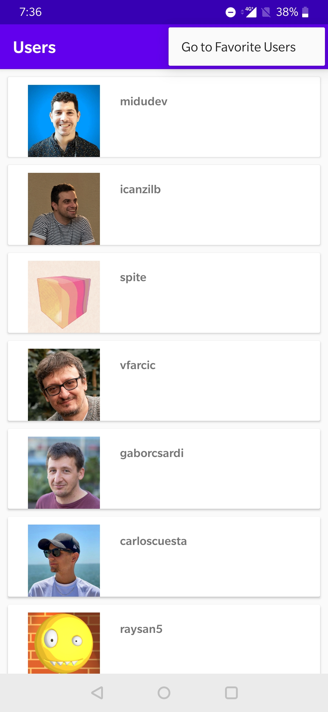
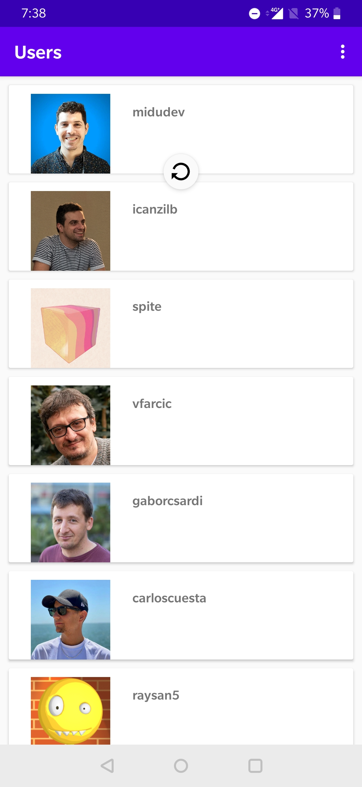
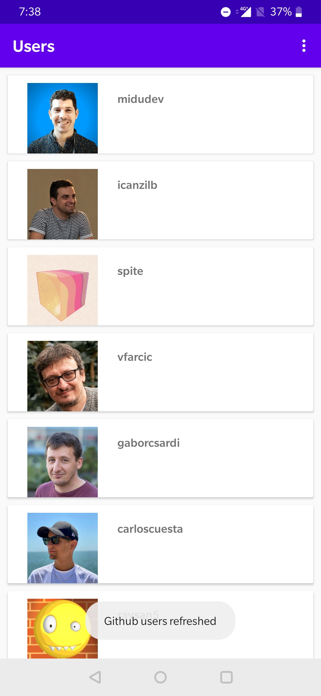

##  Android Application to fetch Github users, view their details and save favorites

#### Set of users from Github 

#### Click on a User and view details

#### Save as favorite

&nbsp;&nbsp;&nbsp;&nbsp;&nbsp;&nbsp;&nbsp;&nbsp;&nbsp;&nbsp;&nbsp;&nbsp;

    

#### Refresh Users

&nbsp;&nbsp;&nbsp;&nbsp;&nbsp;&nbsp;
